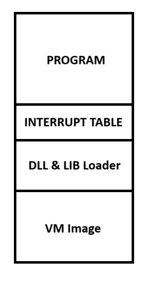

# CodeFusion

## Contents
* [Goals & Features](#goals--features)
* [Dependencies](#dependencies)
    * [Building CodeFusion](#building-codefusion)
    * [Working with CodeFusion](#working-with-codefusion)
* [Tools](#tools)
    * [CodeFusion (Library)](#codefusion-library)
    * [CodeFusion.ASM](#codefusionasm)
    * [CodeFusion.Builder](#codefusionbuilder)
    * [CodeFusion.Dumper](#codefusiondumper)
    * [CodeFusion.Execution](#codefusionexecution)
    * [CodeFusion.Image](#codefusionimage)
* [Structure](#structure)
    * [Program](#program)
    * [Interrupt Table](#interrupt-table)
    * [DLL & LIB Loader](#dll--lib-loader)
    * [VM Image](#vm-image)

## Goals & Features

There are many Virtual Machines and ByteCode Interpreters, but what are the features of CodeFusion and what are the development goals.

* No pre-installation of any utillities when    running programs, like a specific java version

* No highly produced output when releasing programs, like release .NET Core program with a self containted image

* Flexibel and Extensible programming, be able to write static and dynamicly libs. Code interaction with native code through C/C++.

* Small executable code. Only contains things that are needed from the VM-Image over the STD-Lib to the program

## Dependencies

CodeFusion depends one other tools to be able to work properbly all tools are listed here

### Building CodeFusion

* Any C/C++ compiler e.g. gcc
* .NET Core 7.0

### Working with CodeFusion

* .NET Core 7.0 Runtime
* The GNU-Linker (ld) (Is under Windows in the binaries included)

## Tools 

### CodeFusion (Library)
Contains all basic information like Opcodes, Metadata etc. of CodeFusion. When you want to create your own tool it's the best to use the library for basic definitons

### CodeFusion.ASM
Is the CLI for working with assembly files (.cf). Use the tool to compile assebly files to executable or relocatable object. Also the Tool proviedes functions like combining objects to one.

### CodeFusion.Builder
Is the CLI for combining a executable object its VM Image into a native executable of the operating system.

### CodeFusion.Dumper
Is a small tool to dump information about a object file. Note that it's only a side product that was created durring development.

### CodeFusion.Execution
Is a small CodeFusion Interface for excecuting executable object files in there raw form.

### CodeFusion.Image
Contains the source code for a basic CodeFusion VM Image.

## Structure

### Program
The Program section contains the actual code written by the user and the if needed the standard library

### Interrupt Table
The Interrupt Table contains all implmented interrupts like Operating System depended syscalls but can also handle costume interrupts written in native code.

### DLL & LIB Loader
The DLL and LIB loader is for loading Libraries (**Linux**: .so, .a, **Windows**: .dll, .lib) into the program it's depend on the used image and Operating System and is nativly written.

### VM Image
The VM Image is the execution code that executions the instructions. Mostly it's a highly comprimissed version of the normal CodeFusion executable written in native code.

If the CodeFusin source-code is compiled into a library the image is only a small one thats providing the connection point beetween the library and the executable. 

Every Operating System needs it own VM Image and a basic Interrupt Table to be able to run CodeFusion programs